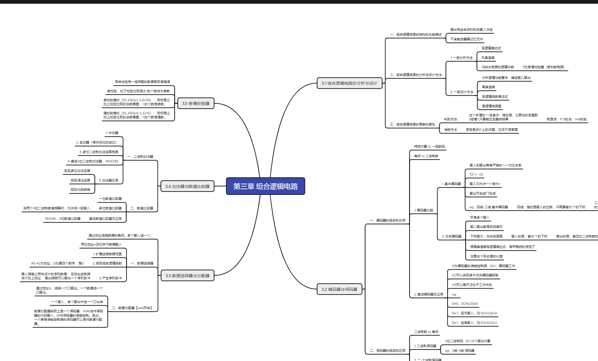

# md-to-xmind

一个轻量的 Python 工具，用于把 Markdown 文件转换为 XMind Zen 兼容的 .xmind 文件。

这个项目特别适合以下场景：

- 把 Obsidian 笔记快速整理成脑图
- 把结构化 Markdown 文档导入 XMind 做二次梳理
- 批量把一组 Markdown 提纲转换成可视化思维导图

项目目前是一个单文件脚本，没有第三方运行时依赖，开箱即可使用。

## 效果预览



## 功能特性

- 支持单个 .md 文件转换
- 支持批量转换目录下的 .md 文件
- 自动以 Markdown 文件名作为脑图根节点
- 支持把标题层级转换为脑图层级
- 支持无序列表和有序列表
- 支持引用块、代码块和表格内容
- 支持清洗常见 Markdown 行内格式
- 兼容部分 Obsidian 语法，例如双链和图片嵌入
- 输出 XMind Zen 兼容的 .xmind 压缩包格式

## 支持的 Markdown 语法

当前脚本对以下内容有明确支持：

- 标题：# 到 ######
- 无序列表：- item
- 有序列表：1. item
- 引用：> quote
- 围栏代码块：``` ... ```
- 表格：标准 Markdown 表格
- Markdown 链接：[text](url)
- 行内代码：`code`
- 粗体：**bold**
- 高亮：==highlight==
- Obsidian 双链：[[Page]]
- Obsidian 别名链接：[[Page|Alias]]
- Obsidian 图片嵌入：![[image.png]]，会被忽略

## 转换规则

为了让输出结果更适合脑图结构，脚本会做一些简化处理：

- 文件名会作为根主题标题
- 标题会形成主要层级结构
- 段落会作为当前节点下的普通子节点
- 列表会转换为子节点树
- 表格会被合并为纯文本节点
- 代码块会保留文本内容，但不会保留语法高亮信息
- 图片会被忽略，不会嵌入到 XMind 文件
- 链接 URL 不会保留，只保留显示文本

## 目录批量转换规则

当输入是一个目录时：

- 只处理该目录第一层中的 .md 文件
- 不递归处理子目录
- 每个 Markdown 文件都会在同目录生成对应的 .xmind 文件

## 环境要求

- Python 3.8 及以上
- Windows、macOS、Linux 均可运行
- 无第三方运行时依赖

## 快速开始

### 1. 克隆项目

```bash
git clone <your-repo-url>
cd md-to-xmind
```

### 2. 可选：创建虚拟环境

Windows PowerShell:

```powershell
python -m venv .venv
.\.venv\Scripts\Activate.ps1
```

macOS / Linux:

```bash
python3 -m venv .venv
source .venv/bin/activate
```

### 3. 安装依赖

这个项目没有第三方运行时依赖，但保留了 requirements.txt，方便统一安装流程：

```bash
pip install -r requirements.txt
```

### 4. 直接运行脚本

转换单个文件：

```bash
python md2xmind.py note.md
```

转换一个目录中的所有 Markdown 文件：

```bash
python md2xmind.py ./notes
```

### 5. 作为可安装命令行工具使用

仓库已补充 pyproject.toml，可以直接本地安装：

```bash
pip install .
```

安装后可使用命令：

```bash
md2xmind note.md
md2xmind ./notes
```

## 使用示例

输入 Markdown：

```md
# 项目规划

项目背景说明。

## 目标
- 明确范围
- 拆解任务
  - 输出原型
  - 开发实现

## 风险
1. 时间紧张
2. 需求变更
```

生成的脑图结构大致如下：

```text
项目规划.md
└─ 项目规划
   ├─ 项目背景说明。
   ├─ 目标
   │  ├─ 明确范围
   │  └─ 拆解任务
   │     ├─ 输出原型
   │     └─ 开发实现
   └─ 风险
      ├─ 时间紧张
      └─ 需求变更
```

输出文件名默认与输入文件同名，仅后缀改为 .xmind。

## 命令行行为

如果未传入参数，脚本会打印帮助信息：

```bash
python md2xmind.py
```

如果传入的不是 .md 文件，脚本会报错退出。

## 项目结构

```text
.
├─ .github/
│  └─ workflows/
│     └─ ci.yml
├─ tests/
│  └─ test_md2xmind.py
├─ demo.png
├─ LICENSE
├─ md2xmind.py
├─ pyproject.toml
├─ README.md
└─ requirements.txt
```

## 开发与测试

运行单元测试：

```bash
python -m unittest discover -s tests -p "test_*.py" -v
```

如果你希望本地安装后再测试：

```bash
pip install .
python -m unittest discover -s tests -p "test_*.py" -v
```

## 适用范围与限制

这是一个面向“结构提取”的转换器，不是完整的 Markdown 渲染器。以下限制需要提前了解：

- 不会保留富文本样式，只保留清洗后的文本
- 不会嵌入图片、附件或远程资源
- 不会保留 Markdown 链接的 URL
- 不支持复杂 HTML 块
- 不支持递归扫描子目录
- 列表缩进规则相对简单，推荐使用稳定的两空格或四空格缩进

如果你的目标是“保真渲染”，这个脚本并不合适；如果你的目标是“从文档中抽出层级结构做脑图”，它会更高效。

## 发布到 GitHub 前建议

如果你准备把这个仓库公开发布，建议在创建 GitHub 仓库后补充以下内容：

- 替换 README 中的仓库地址占位符
- 在 pyproject.toml 中补充项目主页、Issues 和源码地址
- 根据你的需要补充 Release、Tag 和变更日志
- 如果后续增加更多语法支持，可以补充更多测试样例

## License

本项目采用 MIT License，详见 LICENSE。
